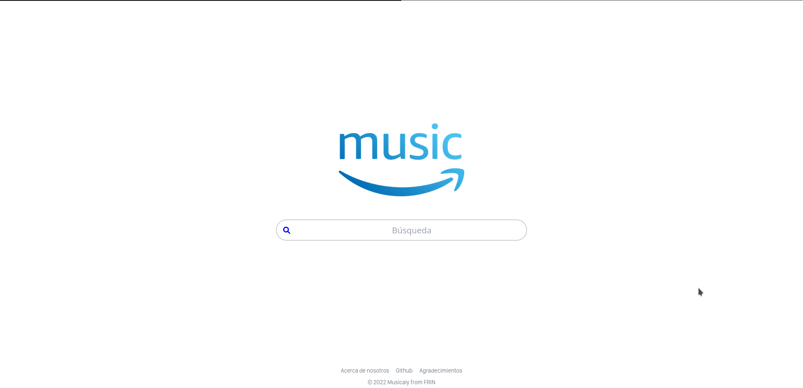
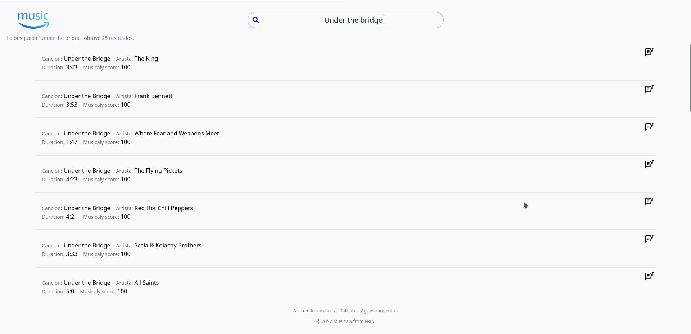

# Musicaly

## Buscador de canciones

Trabajo colaborativo, realizado en las oficinal de Rooftop.

### Funcionamiento técnico requerido

[Documentacion de requerimientos](https://docs.google.com/document/d/1iuPjHL5r-OOtK-oE-0NzAHCID7iYqmNWpfxj-_7i0OE/edit?usp=sharing)

### Screenshot




***
### Tecnologías

Lista de tecnologías utilizadas en el proyecto:

* [Vite](https://vitejs.dev/): Versión 2.9.9 
* [Vue js](https://vuejs.org/): Versión 3.2.25 
* [Vue-Router](https://router.vuejs.org/): Versión 4 
* [Vuex](https://vuex.vuejs.org/): Versión 4.0.2  
* [Axios](https://axios-http.com/docs/intro): Versión 0.27.2 
* [Tailwind CSS](https://tailwindcss.com/): Versión 3.1.4 
* [Post CSS](https://postcss.org/): Versión 8.4.14 
* [Autoprefixer](https://github.com/postcss/autoprefixer): Versión 10.4.7 
* [Node js](https://nodejs.org/es/): Versión 16.15.0

***
### Operatividad

Como instalar e inicializar el proyecto:
```
$ git clone https://github.com/FacuNBustos/musci-rooftop-app.git
$ yarn install
$ yarn run dev
```
